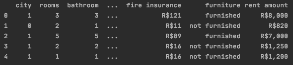
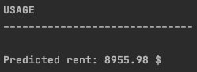

# Multiple Linear Regression
## House rent estimator!
Here we will use `Multiple Linear Regression `to predict the rent of houses. The input atributes
include: number of rooms, bathrooms,fire insurance, parking insurance and etc. 

 ##### We will take our data set from kaggle which is called: brazilian_houses_to_rent.


Link: https://www.kaggle.com/rubenssjr/brasilian-houses-to-rent
- Import Libraries
``` 
    from sklearn import preprocessing, linear_model
    import pandas as pd
    import numpy as np
    import sklearn
```
- Load data (We will choose columns that we want to use)

```
input_data = pd.read_csv('houses_to_rent.csv', delimiter=',')
input_data = input_data[['city','rooms','bathroom','parking spaces','fire insurance','furniture','rent amount']]
```
- Process data


Before:

Remove commas in rent ammount , skipping R$ , using LabelEncoder to binarize furniture atribute.
```
input_data['rent amount'] = input_data['rent amount'].map(lambda i: int(i[2:].replace(',','')))
input_data['fire insurance'] = input_data['fire insurance'].map(lambda i: int(i[2:].replace(',','')))
le = preprocessing.LabelEncoder()
input_data['furniture'] = le.fit_transform(input_data['furniture'])
```
After:


- Check null data and then split data
```
print('-'*30); print('SPLIT DATA');print('-'*30);
x= np.array(input_data.drop(['rent amount'], 1))
y= np.array(input_data['rent amount'])
print('X',x.shape)
print('Y',y.shape)
xTrain,xTest ,yTrain, yTest = sklearn.model_selection.train_test_split(x,y, test_size=0.2)
print('X_train',xTrain.shape)
print('X_test', xTest.shape)
```
Result:


- Training data
```
print('-'*30); print('TRAINING DATA');print('-'*30);
model = linear_model.LinearRegression()
model.fit(xTrain, yTrain)
accuracy = model.score(xTest, yTest)
print('Coefficients(m):',model.coef_)
print('Intercept(c):', model.intercept_)
print('Accuracy:', round(accuracy*100, 3),'%')
```
## Theory of Multiple Linear Regression:

- Evaluation and Example of usage.
```
print('-'*30); print('MANUAL TESTING');print('-'*30);
testVals = model.predict(xTest)
print(testVals.shape)
error = []
for i,testVal in enumerate(testVals):
    error.append(yTest[i] - testVal)
    print(f'Actual value:{yTest[i]} Prediction:{int(testVal)} Error:{int(error[i])}')
print('-'*30); print('USAGE');print('-'*30);
want_to_rent = [ 1, 3, 3,4, 121, 0]
result = model.predict([want_to_rent])[0]
print("\nPredicted rent:", round(result,2),'$')
```
Final Result:


